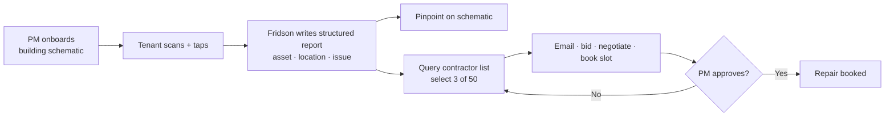

# Fridson — A Suite of AI Employees for Property Management

**Goal:** Win Z2D with a live, scripted 3-minute pitch where a tenant scans a broken asset and — projected behind the presenter — Fridson pinpoints it on the building schematic, writes a structured report, picks the right contractors, and emails/bids/negotiates/books a repair slot, while the property manager only approves.
**Deadline:** Sun 28 Jun 2026 · 16:00 live demo · 15:00 submission
**Owner:** Team Fridson (Shuhia, Chris, Lennert)

**Source of truth:** [[06-Wiki/decisions/2026-06-27-final-commitment|Final Commitment — canonical definition + 3-min demo arc]]
**Build roadmap:** [[ROADMAP|What's next to build]] · **Problem:** [[06-Wiki/Problem]] · **Resolution spec:** [[RESOLUTION-AGENT]]
**👥 Parallel work:** [[team-plans/README|Team Plans — 4 tracks]] · contract: [[team-plans/INTERFACES]] · **execution plans:** [[plans/README|plans/00–07]] — each member works their own track file; this doc stays the single source of truth for phases & gates.

---

## Canonical definition (do not re-debate)

> **Fridson is a suite of AI employees for property management.**

This supersedes all prior framings ("predictive lifecycle platform", "24/7 AI property manager", "scan/tap/route wedge"). Everything below is constructed around the [[06-Wiki/decisions/2026-06-27-final-commitment|Final Commitment]].

**The end-to-end flow (the product):**

1. **Onboarding** — Property manager feeds the **building schematic** into Fridson.
2. **Report** — Tenant scans the broken asset, taps the problem type. Done. They contact no one.
3. **Structured report** — Fridson auto-creates: asset identity · location in building · nature of issue.
4. **Auto-routing** — Fridson queries the contractor list (e.g. picks 3 of 50 relevant providers).
5. **Negotiation + booking** — Contacts them, gets bids, negotiates price, books a repair slot.
6. **Approve-only** — The property manager just approves/disapproves; orchestration is automatic.

---

## Session Protocol
- 🤖 Claude can do autonomously
- 🤝 Claude drafts, human reviews
- 🧑 Human-only action required
- Never skip a GATE — these are explicit checkpoints requiring sign-off

## Decision Framework (Z2D Judging)
Before any major decision, score against:
1. **PRODUCT** — Does this make the product stronger and more functional?
2. **PROBLEM** — Does it sharpen a real pain point in a novel way?
3. **VALIDATION** — Does it add evidence of market demand?
4. **SPEED & DEMO** — Does it move us toward the catchy 3-min demo by Sun 16:00?

Tie-breaker (from source of truth): **"80% quality + lower cost + faster = a win."** Prefer a convincing live/projected beat over a perfect-but-fragile one. Anything not visible in the 3-minute arc is roadmap, not build.

## Human-Action Queue
- [x] 🧑 Complete **Day 1 check-in** on [Z2D Dashboard](https://z2d-base.lovable.app/dashboard) ✅ done
- [x] 🧑 Confirm **Milestone 1** (team confirmed) ✅ done
- [x] 🧑 Redeem **Lovable credits** — code `COMM-ZD2-MAPJ` ✅ done
- ~~🧑 Redeem **Azure credits** ($1,000)~~ — **NOT NEEDED** (agent runs on Supabase Edge; see Blockers)
- [x] 🧑 Confirm **brand spelling** — **LOCKED: Fridson** ✅ *(matches domain/repo/live app; sweep deck for "Fritzson")*
- [ ] 🧑 Confirm **demo hardware** — who presents, where the projection screen goes, phone on same network
- [ ] 🧑 Upgrade to **Cursor Pro** for team usage
- [ ] 🧑 Check **Memtrace** availability on Z2D dashboard

---

## Phase 0 — Grounding & scope lock (read before building)
*make-plan Phase 0. No new code — establish the allowed scope and the current build state so every later phase is self-contained.*

**Inputs to read first (source order):**
- [[06-Wiki/decisions/2026-06-27-final-commitment]] — canonical definition + 3-min arc (PRIMARY)
- [[08-Archive/z2d-ideation-superseded/final-discussion-before-work-session]] — 3-agent suite + data pool framing (archived ideation)
- [[MVP-FLOW]] — scan→tap→route spec · [[RESOLUTION-AGENT]] — route→bid→negotiate→book spec
- [[LOVABLE-PROMPT]] — exact pages, seed data, routing logic already shipped to Lovable

**Where the code is:** the app is cloned in-workspace at `fridson-app/` (repo `github.com/westsoever/fridson-app`, Lovable-connected, separate git history). Agents can edit it directly; commits there go to the app repo, not this vault. Stack: Vite + React + TS + Bun + Supabase (`fridson-app/AGENTS.md`). See root `CLAUDE.md → The app code lives here too`.

**Current build state (verify, don't assume):**
- Live app: [fridson.lovable.app](https://fridson.lovable.app) — home lists 5 assets; `/r/printer-3f` loads scan→tap.
- Built so far: Capture (scan→tap) + basic routing + admin/reports page (Supabase via Lovable).
- Not built yet: schematic onboarding, location pinpoint, contractor directory, bidding/negotiation, booking, the projected activity feed, business-case numbers.

**Allowed scope for the demo (anything outside = roadmap):** the six steps in the canonical flow, rendered so they are visible in Minute 1. Secondary stakeholders (Minute 2) and business case (Minute 3) are narrative + light UI, not full systems.

**Anti-pattern guards:**
- ❌ Do NOT rebuild Capture — it works. Extend it.
- ❌ Do NOT add features absent from the 3-min arc (no sensors/predictive build, no real payments).
- ❌ Do NOT make agent steps that can't be shown on screen — every step must surface in the activity feed.
- ❌ Do NOT block the sub-3s scan flow on the agent — agent runs async, feed updates after.

---

## Phase 1 — Capture → Structured Report (must-have · mostly built)
*Step 2–3 of the flow. The report object is the spine everything else hangs on.*

- [x] 🤖 Verify scan→tap works for all **5 assets** on a phone; both routes distinct (printer/out-of-paper → in-house; bathroom/leak → contractor) with success copy "Sent to facility team" vs "Sent to contractor" ✅ confirmed working
- [x] 🤖 Confirm each report persists a **structured record**: `asset · location/zone · issue · route · timestamp` (the source-of-truth report shape) ✅ persisting with full record
- [x] 🤖 Operator **issue workspace** at `/` shows persisted reports with decision-first triage UI (shadcn, mission-control strip, approve flow) — shipped `fridson-app` `72af388`; see [[ui-revamp-update-2026-06-27]]
- [ ] 🤖 Verify workspace on **Lovable live** after migration `20260627200000_triage_operations` applies (acknowledge, urgency, duplicate fields)

**Verification checklist:**
- [ ] All 5 `/r/{asset}` pages load < 2s on 4G and show correct asset + zone
- [ ] A tapped issue creates a row visible in the admin page within 2s
- [ ] Two different issues land in two visibly different destinations

**Anti-pattern guards:** don't add login; don't require typing; keep the success screen instant (agent work happens after, async).

## Phase 2 — Onboarding & Schematic Pinpoint (demo Minute 1 background, part A)
*Step 1 + the "AI pinpoints the exact location" beat. This is the visual that makes the demo click.*

- [x] 🤖 Seed **one building schematic** image (a floorplan; can be a simple multi-floor SVG/PNG) as the demo building ✅ `floorplan.svg` in `403ee22`
- [x] 🤖 Add `location` coords to each of the 5 seed assets (x/y + floor) mapped onto the schematic ✅ seeded in Track 1
- [ ] 🤖 On report, **pinpoint the asset on the schematic** (marker/pulse) on the projected/admin view in real time — *partial:* `/schematic` has per-floor selector + open-report markers (pushed `6b50e0c` on `origin/main`); **verify pulse on live** after migrations apply
- [ ] 🤝 (Onboarding narrative) one screen/slide showing "PM uploads schematic → assets registered" — can be pre-done, shown as the setup step

**Verification checklist:**
- [ ] Scanning `printer-3f` makes a marker appear at the printer's spot on the schematic within ~2s
- [ ] The schematic is legible when projected (test at distance)

**Anti-pattern guards:** don't build a real CAD/schematic importer — a seeded floorplan + hardcoded coords is enough for the demo.

## Phase 3 — AI Property Manager: route → bid → negotiate → book (demo Minute 1 background, part B — the WOW)
*Steps 4–6. The headline. See [[RESOLUTION-AGENT]] for the detailed agent spec. Real where stable, scripted fallback where not — "80% quality" is explicitly acceptable.*

- [ ] 🧑 GATE: Phases 1–2 demo-able before any agent work starts
- [ ] 🤖 ▶ NEXT **Approve → agent → mock provider email** — Confirm PM **Approve** on a workspace ticket async-invokes the agent (`approveReport` → `process-research` and/or resolution `POST /agent/decision` per [[plans/02-reconcile-agent-path|Phase 2]]); agent selects a seeded provider from the directory and sends an RFQ email via a **mock mail path** (Resend with `AGENT_LIVE_EMAIL=1`, or a controlled team inbox — not live vendor addresses) so we can open the message and verify payload (report id, asset, issue, provider name)
- [x] 🤖 Seed a **contractor/provider directory** (~50 rows: name, trade, zone, email, rough rate) so selection of "3 of 50" is real ✅ 55 providers in migration `403ee22`
- [ ] 🤖 Agent **selects ~3 relevant providers** from the directory based on issue type + zone (visible reasoning line) — *built in resolution agent; verify on live after deploy*
- [ ] 🤖 Agent **sends real RFQ emails** to demo/sandbox vendor inboxes; parses replies into comparable bids
- [ ] 🤖 Agent **negotiates** within FM-set bounds (target/ceiling) — at least one real email round; voice-call is stretch
- [ ] 🤖 Agent **books a repair slot** (calendar hold / confirmation message) → surfaces "Technician booked for {date}"
- [ ] 🤖 **PM approve/disapprove** control gates the booking (no autonomous spend) + audit log of every step
- [ ] 🤝 Prepare **recorded fallbacks** (pre-fetched bids, pre-sent emails, pre-booked slot, call clip) so it never breaks live

**Verification checklist:**
- [ ] Click **Approve** on an `awaiting_approval` ticket → agent run visible in audit log / `events` within ~30s (no page hang)
- [ ] Outbound RFQ email lands in the **mock/controlled inbox** with correct report + provider context
- [ ] From one scan, the activity feed shows: selected providers → emails sent → bids in → negotiated price → slot booked
- [ ] PM "Approve" visibly confirms; "Disapprove" re-routes/loops
- [ ] A real email is sent to a controlled inbox and a real reply is parsed (at least one)

**Anti-pattern guards:** no real purchases/payments; AI must disclose itself on any call; label any pre-fetched data as such in rehearsal notes; agent must never block the scan success screen.

## Phase 4 — Background Activity Projection (demo presentation layer)
*The projected screen behind the presenter that ties Phases 2–3 into one live narrative.*

- [x] 🤖 Build a **projection view**: building schematic + a live **agent activity feed** (location pinpoint → report → providers queried → emails → bids → negotiation → booked) ✅ `/projection` shipped `403ee22`; mock ~54s timeline works offline
- [ ] 🤖 Wire the feed to real events from Phases 2–3 (websocket/poll); scripted timeline as fallback — *built (`?feed=real`); blocked on migrations + edge deploy (Phase 1 gates)*
- [ ] 🤝 Tune pacing so the whole flow is **visible and explained within ~1 minute**
- [ ] 🤝 Make it legible from stage (large type, clear step states)

**Verification checklist:**
- [ ] One scan drives the entire projected sequence end-to-end without a click
- [ ] Total runtime of the visible flow ≤ ~60s

**Anti-pattern guards:** don't show raw logs/JSON on stage; human-readable step cards only.

## Phase 5 — Context & Ecosystem (demo Minute 2)
*Reporting creates context; context is consumed by other stakeholders. The triage shift.*

- [x] 🤝 Define **secondary stakeholder use cases** with one concrete example each: insurers (proof-of-issue), energy/utilities (consumption/repair audit), repair/compliance ✅ [[pitch/ecosystem]]
- [x] 🤖 A simple **context record** view per ticket (the same event → value for multiple stakeholders) ✅ `StakeholderContextPanel` + Context tab in workspace — pushed `c77bc42`
- [x] 🤝 Script the **triage-shift narrative**: "before Fridson the PM orchestrated everything; now they approve/disapprove" ✅ verbatim line in [[pitch/ecosystem]] + [[pitch/script]]

**Verification checklist:**
- [ ] One ticket page shows ≥2 stakeholder lenses on the same event
- [ ] The triage-shift line is in the script and ≤20s

**Anti-pattern guards:** don't build real insurer/energy integrations — show the framing + a mock record.

## Phase 6 — Business Case (demo Minute 3)
*Quantify the win.*

- [x] 🤝 Quantify **cost reduction** (X% / €) vs manual triage + sourcing ✅ [[pitch/business-case]] (15–25%, DKK 140–320k/yr)
- [x] 🤝 Quantify **time improvement** (resolution cycle: days → hours) ✅ [[pitch/business-case]] (~3–5 days → same-day)
- [x] 🤝 State the **quality tradeoff** framing with numbers: "80% quality + cheaper + faster = win" ✅ [[pitch/business-case]]
- [ ] 🤝 One slide/visual with the 3 numbers + source assumptions [[04-Resources/Z2D/hackathon-strategy]] — *copy from business-case into deck*

**Verification checklist:**
- [ ] Three defensible numbers with stated assumptions
- [ ] Fits in ≤60s of narration

**Anti-pattern guards:** don't invent unsourced stats — tie to the validated $2.98B market + documented FM time-sink.

## Phase 7 — Pitch Polish, Dry-run & Submission (Sun ~09:00–16:00)
*make-plan final verification phase.*

- [ ] 🧑 Complete **Day 2 check-in** on Z2D dashboard
- [ ] 🤖 Harden the live demo path — no dead ends, fast load, fallbacks armed
- [x] 🤝 Lock the **3-minute script** (Min1 live demo+narration · Min2 ecosystem · Min3 business case) ✅ [[pitch/script]] — re-time at dry-run
- [ ] 🧑 Print **5 QR codes** for demo props + confirm phone/projector hardware
- [ ] 🤝 Final submission prep — **Milestone 2 by Sun 15:00**
- [ ] 🧑 GATE: Full **dry-run** of the 3-min pitch with the team before Sun 16:00
- [ ] 🧑 Live demo & judging — Sun 16:00

**Final verification (whole-pitch):**
- [ ] End-to-end dry-run hits exactly 3 minutes
- [ ] Every live beat has a tested fallback
- [ ] Each minute maps to its source-of-truth section

---

## Event Schedule (reference)

### Sat 27 Jun
| Time | Event |
|------|-------|
| 09:00 | Doors open |
| 09:30 | Team formation & kick-off |
| 13:00 | Lunch |
| 13:30 | Building (mentors on-site) |
| **14:00** | **Milestone 1 — team confirmed** |
| 20:00 | Pitch & Dine — Day 1 progress |
| 22:00 | Day 1 wrap |

### Sun 28 Jun
| Time | Event |
|------|-------|
| 09:00 | Doors open |
| **15:00** | **Milestone 2 — submission done** |
| **16:00** | **Live demos & judging** |
| 18:00 | Winner announcement |

---

## Team & Resources

**Execution plans:** [[plans/README|plans/00–07]] — parallel agent pickup for deploy gates, live verify, pitch logistics, doc reconciliation.

### Team Fridson (3/5)
| Member | Email | Role |
|--------|-------|------|
| Shuhia | shuhia.on@gmail.com | admin |
| Chris | chrisw0129@gmail.com | member |
| Lennert | jessenlennert@outlook.com | member |

### Credits & Tools
| Resource | Status | Details |
|----------|--------|---------|
| Cursor | ✅ claimed | upgrade to Pro for team |
| Lovable | ✅ redeemed | code `COMM-ZD2-MAPJ` |
| ~~Azure~~ | ✅ not needed | Agent runs on Supabase Edge — credits not required |
| Memtrace | ⏳ check | Z2D dashboard |
| Claude Code | active | Sonnet 4.6, high effort |

### Fellowship prize (top teams)
$25,000 cloud credits · Copenhagen workspace (The Shack, Antler, Microsoft) · ongoing mentorship

---

## Blockers

**Deployment gates (turn the demo live):**
- [x] 🌐 **Push app to Lovable** — ✅ `origin/main` = `c77bc42` (schematic merge `6b50e0c` + stakeholder Context UI + hybrid agent path). Frontend rebuilds from this.
- [ ] 🔑 **Apply 7 migrations** — via Lovable Supabase sync *or* commands in [[plans/DEPLOY-BLOCKER-REPORT]]. Latest adds triage ops (`urgency`, `acknowledged_at`, `duplicate_of`, `report_audit_events`, etc.). ⚠️ **BLOCKED** — CLI 403 without project-scoped `SUPABASE_ACCESS_TOKEN`.
- [ ] 🔑 **Deploy edge functions** — `bunx supabase@latest functions deploy agent process-triage process-research` (or via Lovable). ⚠️ **BLOCKED** — same token issue; see [[plans/DEPLOY-BLOCKER-REPORT]].
- [ ] 🔑 **Set function secrets** (Supabase dashboard) — `LOVABLE_API_KEY` (triage + chat + research); **`RESEND_API_KEY` + `AGENT_LIVE_EMAIL=1`** for mock-provider RFQ email on Approve (route to team-controlled inbox, not `*@demo.test` vendor addresses). Slack removed from app.
- [x] ❓ **Reconcile dual agent trigger** — ✅ **Option A hybrid** documented in `reports.functions.ts`: webhooks for triage/research + resolution agent for projection events on Approve — pushed `c77bc42`
- [ ] 🖥️ **Stage feed** — open `/projection?feed=real` on the demo laptop; confirm Realtime on `events`

**Resolved this session:** ~~Azure credits~~ (agent runs on Supabase Edge — Azure NOT needed) · ~~Schematic asset~~ (`floorplan.svg` + coords seeded) · ~~Push to Lovable~~ (`6b50e0c` on `origin/main`) · ~~Dual agent trigger~~ (Option A hybrid documented locally) · ~~vendor inboxes for the loop~~ (stubbed fallback works; only needed for *real* email).

**Still open (human decisions / logistics — see [[pitch/logistics]]):**
- [x] ~~**Brand spelling**~~ — **LOCKED: Fridson** ✅ *(2026-06-28, Phase 4)*
- [ ] 🧑 **3-minute timing** — full-team dry-run on real hardware (projection runs ~54s; needs rehearsal)
- [ ] 🧑 **QR prints + hardware** — 5 codes ([[pitch/qr-codes]]), presenter, phone, projector, same network
- [ ] 🧑 **Milestone 2 submission (15:00)** — paste from [[pitch/milestone-2-copy]]
- [ ] 🧑 **Full dry-run (before 16:00)** — [[pitch/dry-run-checklist]]
- [ ] 🌐 **Push vault to origin** — knowledgespace `main` ahead 2 commits (`5ac85ad` plans + logistics docs)
- [ ] ❓ **Dangling git remote** — vault repo has extra remote `fridson-app → westsoever/fridson-app`; a stray push could send vault notes to the app repo. Decide: `git remote remove fridson-app`.
- [ ] 🔑 **Committed `.env` in app repo** — only anon/publishable keys (public-safe); no service-role key present. Low risk, but avoid adding secrets to it.

---

## Status Log
| Date | Summary |
|------|---------|
| 2026-06-27 | Project created from inbox — initial direction: fintech credit analysis |
| 2026-06-27 | Problem pivot — team locked office lifecycle / predictive maintenance ([[04-Resources/Z2D/finding-the-problem]]) |
| 2026-06-27 | Merged to main; problem defined in [[06-Wiki/Problem]]; project renamed to z2d-lifecycle |
| 2026-06-27 | MVP flow designed — [[MVP-FLOW]] (scan QR → tap issue → Slack to FM/contractor) |
| 2026-06-27 | Lovable prompt + validation map drafted — [[LOVABLE-PROMPT]]; app host locked to Lovable |
| 2026-06-27 | [[RESOLUTION-AGENT]] added — research → source → negotiate replacements |
| 2026-06-27 | Milestone 1 confirmed, Day 1 check-in done, Lovable credits redeemed — demo live at fridson.lovable.app |
| 2026-06-27 | Phase 1 validation/competitor research done; QR→Slack flow confirmed working |
| 2026-06-27 | Data Brain session — "24/7 AI property manager" positioning [[04-Resources/Z2D/data-brain]] |
| 2026-06-27 | Reframed to AI agent suite + data pool ([[08-Archive/z2d-ideation-superseded/final-discussion-before-work-session]]) |
| 2026-06-27 | **Source of truth locked** — [[06-Wiki/decisions/2026-06-27-final-commitment]]. Plan rebuilt (make-plan style) around the 3-min demo arc: onboarding+schematic → scan → structured report → pinpoint → route/bid/negotiate/book → approve. Resolution loop promoted from stretch to demo centerpiece. Added [[ROADMAP]] |
| 2026-06-27 | Inbox processed — final-commitment → 06-Wiki/decisions; stakeholder map → 05-Knowledge; superseded ideation (final-discussion, data-brain ×2, painpoints, initial-feedback) → 08-Archive/z2d-ideation-superseded |
| 2026-06-27 | Split plan into 4 parallel tracks for the team → [[team-plans/README]] (Capture&Data · Schematic&Projection · Agent Backend · Pitch&Business) + [[team-plans/INTERFACES]] shared contract so tracks build simultaneously without file collisions |
| 2026-06-27 | Track 1: scan→tap verified for all 5 assets + reports persisting full record. Set ▶ NEXT per track: Chris=seed coords+50 providers (unblocks team), Slavi=projection+mock events, Alex=agent skeleton+selection (mocked), Lennert=lock brand spelling + redeem Azure (unblocks Alex) |
| 2026-06-27 | **App repo cloned in-workspace** at `fridson-app/` (separate repo `westsoever/fridson-app`, Lovable-connected) so agents in this vault can edit the app directly. Git-ignored + Obsidian-excluded so the two repos stay separate. Documented in `CLAUDE.md`, `index.md`, README, team-plans. Flagged: dangling `fridson-app` remote on the vault repo + committed `.env` in app repo. |
| 2026-06-27 | **All 4 tracks built in parallel** (4 subagents) + integrated, committed in `fridson-app` `403ee22` (not pushed): T1 data spine (migrations/coords/floorplan/55 providers/events), T2 `/projection`+`/schematic` w/ mock+real feed, T3 Deno resolution-agent (select→bid→negotiate→book→approve, 10 tests, Azure not needed), T4 `pitch/` docs. Wired `submitReport`→agent; fixed a `tsc` regression (supabase single-row inference under the bigger schema). tsc + vite build green. Remaining = deploy gates (push/migrate/deploy/env) + human logistics. |
| 2026-06-27 | **App pushed to Lovable** — `403ee22` is now on `origin/main`, then merged with Alex's `ai-agent-flow` (durable webhook agents: `process-triage`/`process-research` + `report_agent_webhooks` migration) → `4e36b43`. Lovable rebuilds the frontend from this. Migrations (now 6) + edge-function deploy still pending: handled by Lovable's Supabase sync or an authenticated CLI — no `SUPABASE_ACCESS_TOKEN`/DB password available this session. Flagged a **dual agent-trigger** to reconcile (my `submitReport`→agent fetch + Alex's report DB webhook). |
| 2026-06-27 | **UI revamp shipped** — design-system research processed; operator workspace realigned (decision-first triage, shadcn, mission control, reporter multi-step + status page). Pushed `fridson-app` `72af388`. Research filed to `04-Resources/fridson/`. Follow-up: apply migration 7, keyboard inbox, merge UI, photo upload. |
| 2026-06-28 | **Side missions shipped in app:** `/dashboard` KPI page (archived); `/graph` live data-flow map (archived); System Map rewired to linear ticket topology with **Fridson AI** endpoint (`fd3caeb`, on `origin/main`). `/schematic` enhanced with per-floor selector + open-report markers (`e4234ec`, **local only — not pushed**). Vault docs archived + plan filed. Next: push schematic commits, apply migrations, deploy functions, reconcile agent trigger, dry-run. |
| 2026-06-28 | **Execution plans split** into [[plans/README|plans/00–07]] for parallel agent pickup — deploy gates, agent reconcile, live verify, pitch logistics, optional Minute 2 UI, doc reconciliation, final dry-run. |
| 2026-06-28 | **▶ NEXT set:** Phase 3 — verify Approve button triggers agent + sends RFQ email via mock provider (controlled inbox); approve-flow checklist added. |
| 2026-06-28 | **Phase 6 doc reconciliation:** push gate ✅ (`6b50e0c` on `origin/main`); migrate/deploy still blocked (no CLI token). Azure struck everywhere; brand locked **Fridson**; roster = Shuhia/Chris/Lennert. ROADMAP + track files synced; agent path = Option A hybrid (local). ▶ NEXT: apply migrations, deploy functions, verify live demo path (Phase 3). |
