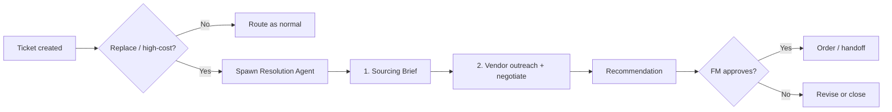

# Resolution Agent — Research, Source & Negotiate

**Project:** [[02-Projects/z2d-lifecycle/ACTIVE_PLAN|Z2D Lifecycle Platform]] · Team Fridson
**Status:** Spec — headline stretch feature (build only after [[MVP-FLOW|Scan/Tap/Route]] must-have is solid)
**Related:** [[MVP-FLOW|MVP Flow]] · [[06-Wiki/Problem|Problem]] · [[06-Wiki/Problem-Analysis|Problem Analysis]]

---

## One-sentence pitch

> When a ticket is created for a broken asset, an AI agent spins up that researches the cheapest way to replace it, then emails and calls vendors to gather options and negotiate the price — turning a report into a resolution, autonomously.

---

## Where this fits: the fourth act

The product now has four layers. The first two are the Sunday must-have; this feature is the **Resolve** layer — the differentiator that beats Snapfix and MaintainX, which stop at the work order.

| Layer | What it does | Status |
|-------|--------------|--------|
| **1. Capture** | QR scan → tap issue, zero login | Must-have (built) |
| **2. Route** | Smart-route to in-house FM or contractor | Must-have (built) |
| **3. Resolve** | **Resolution Agent: research → source → negotiate → recommend** | **This spec** |
| **4. Predict** | Sensors + history → predict failures | Roadmap |

> **Positioning shift:** Competitors give you a *work order*. We give you a *resolved order*. The research flagged "AI-assisted routing and escalation" as the strongest differentiator — this is its full expression.

---

## Trigger

The agent does **not** fire on every ticket. It activates when a ticket is classified as **replace / high-cost**:

```
if ticket.resolution_type == "replace"        # asset beyond repair
   or ticket.issue_label in [Appliance broken, Projector broken, Not running]
   or ticket.estimated_cost > THRESHOLD:       # e.g. > €150
     → spawn Resolution Agent
```

Cheap/replenishment issues (out of paper, no soap) skip the agent — they just route as today. The agent is reserved for decisions that actually cost money and time, which is exactly where FMs lose hours.



---

## Capability 1 — Replacement research → Sourcing Brief

**Goal:** within seconds of the ticket, produce a structured overview of the cheapest viable way to replace the asset.

**Input:** asset record (type, model, specs, age, zone), issue label, "beyond repair" flag.

**Steps:**
1. **Identify the exact product** — resolve model + key specs from the asset record (enrich via web lookup if specs are thin).
2. **Search the market** — like-for-like, a cheaper equivalent, and a refurbished/used option across retailers and marketplaces.
3. **Compare** on unit price, shipping, lead time, warranty, and vendor reliability.
4. **Rank** — flag the *cheapest viable* and a *recommended (best value)* option.
5. **Output the Sourcing Brief.**

**Sourcing Brief (output shape):**

| Field | Example |
|-------|---------|
| Asset | Projector · Meeting room 4F (Epson EB-X06) |
| Verdict | Beyond economic repair — replace |
| Cheapest viable | €389 · refurb equivalent · 5-day lead · 6mo warranty · [link] |
| Recommended | €459 · like-for-like new · 2-day lead · 24mo warranty · [link] |
| Premium/fast | €529 · next-day · in stock · [link] |
| Sources checked | 5 vendors · timestamp |
| Notes | Bulk discount likely above 3 units; ask vendors |

---

## Capability 2 — Vendor outreach & negotiation

**Goal:** go beyond list prices — contact vendors directly to confirm availability, get real quotes, and negotiate.

**Email (RFQ) path:**
1. Draft a tailored RFQ per candidate vendor — asset specs, quantity, delivery zone, deadline, ask for best price + lead time.
2. Send via email API; track threads.
3. Parse replies, normalise quotes back into the Sourcing Brief, re-rank.

**Voice (call) path — the headline demo moment:**
1. AI voice agent calls the vendor, **identifies itself as an AI assistant** acting for the facility team.
2. Asks structured questions: availability, price, lead time, warranty.
3. Negotiates within FM-set bounds (target price, walk-away ceiling) — e.g. "Can you do better than €459 if we commit today?"
4. Logs a transcript + extracted quote.

**RFQ email template (draft):**

```
Subject: Quote request — {asset model} ×{qty}, delivery to {city}

Hi {vendor},

We're sourcing a replacement {asset model} ({key specs}) for an office in {city}.
Could you share:
  • Best unit price for {qty}
  • Lead time / availability
  • Warranty terms
We're comparing options today and can move quickly. Thanks.

— Facility ops (sent via Z2D Lifecycle assistant)
```

---

## Human-in-the-loop guardrails (non-negotiable)

The agent is autonomous in *research and outreach*, never in *spending*.

- **No autonomous purchase** — a human FM approves before any order or commitment.
- **Spend + approval thresholds** — anything above a cap escalates to a named approver.
- **Negotiation bounds** — FM sets target and ceiling; the agent never exceeds them.
- **Full audit trail** — every email, call transcript, and quote is logged against the ticket.
- **AI disclosure on calls** — the agent always states it is an AI assistant (ethical + legally required in several jurisdictions).
- **Demo safety** — use sandboxed vendor inboxes / a teammate or test number; clearly label any pre-fetched data as such.

---

## Data model (extends MVP-FLOW)

```
Ticket (extends Report)
  resolution_type   enum   repair | replace | replenish
  estimated_cost    number
  agent_status      enum   idle | researching | outreach | awaiting_approval | done

SourcingBrief
  ticket_id         FK
  options           [SourcingOption]
  recommended_id    string
  created_at        datetime

SourcingOption
  vendor            string
  price             number
  lead_time_days    number
  warranty          string
  condition         enum   new | refurb | used
  source_url        string
  quote_source      enum   listing | email | call

VendorContact
  ticket_id         FK
  vendor            string
  channel           enum   email | call
  status            enum   sent | replied | quoted | no_response
  transcript_url    string (calls)
  quoted_price      number
```

---

## Tech approach (hackathon-friendly)

> **2026-06-28 update:** Agent **ships on Supabase Edge** (`supabase/functions/agent/`). Azure credits are **not required** — see [[ACTIVE_PLAN]] blockers.

| Need | Option | Notes |
|------|--------|-------|
| Agent orchestration | LLM (Claude) with tool-calling | Plans research → outreach → ranking |
| Web research | Tavily / Brave / SerpAPI + light scrape | Returns live options for the brief |
| Email send + inbound | Resend / SendGrid + inbound parse | RFQ out, quotes back |
| Voice calls | Vapi / Bland.ai or Twilio + Realtime API | The "wow" call; have a recorded fallback |
| Store | Same app DB (Supabase from Lovable) | New tables above |
| Hosting | **Supabase Edge Functions** | ~~Azure ($1,000 credits)~~ — not needed |

Keep the agent as a **separate service/edge function** triggered by ticket creation, so it never blocks the sub-3-second Capture→Route flow.

---

## Demo plan for Sunday (only if must-have is rock-solid)

1. Judge scans **Meeting room 4F** QR → taps **"Projector broken"**.
2. Ticket created → routes to contractor (existing flow) **and** shows *"Resolution Agent started"*.
3. ~10–20s later: **Sourcing Brief** appears — 3 options with prices, lead times, links (live search if stable, else pre-fetched + labelled).
4. Agent **drafts + sends an RFQ email** to a demo vendor inbox (real, on screen).
5. **Headline:** agent **places a live call** to a "vendor" (teammate or sandbox number), negotiates, logs the quote.
6. FM taps **Approve** on the recommended option — *no real purchase*.
7. Close: *"Report to resolved — sourced and negotiated — without a human lifting a finger."*

**Fallbacks:** pre-recorded call clip; pre-fetched brief; email to a controlled inbox. Never let this break the must-have demo.

---

## Z2D scoring of this feature

| Criterion | Effect |
|-----------|--------|
| **PRODUCT** | Major — turns a reporting tool into an autonomous procurement agent. Clear moat vs Snapfix/MaintainX. |
| **PROBLEM** | Extends the pain credibly — FMs lose hours researching, emailing, and haggling over replacements; lifecycle cost lives here. |
| **VALIDATION** | Procurement/negotiation time-sink is well documented; ties to the lifecycle-cost pain already validated. |
| **SPEED & DEMO** | High-risk, high-reward theatre. A live AI negotiation call is the most memorable beat — but only if the core demo is already bulletproof. |

---

## Risks & scope discipline

- **Scope creep is the #1 risk.** The research warns: keep the MVP brutally small. This is a **stretch**, gated behind a working Capture→Route demo. Do not start it until that gate passes.
- **Fake-AI smell** — judges will notice. Make the brief and at least the email real; clearly label anything simulated.
- **Flaky conference wifi** — voice calls may fail live; rehearse with a recorded fallback.
- **Legal/ethical** — AI must disclose itself on calls; no binding commitments without human approval.

---

## Roadmap positioning

This is the bridge from the Sunday demo to a real business:

1. Capture + Route (today)
2. **Resolve: Sourcing Brief** (first slice of this agent — research only, no calls)
3. **Resolve: RFQ email outreach**
4. **Resolve: AI negotiation calls**
5. Asset history + recurring-issue analytics
6. Predict: sensors + condition-based alerts feeding the same Resolve engine

---

## Related

- [[MVP-FLOW|MVP Flow — Scan, Tap, Route]]
- [[LOVABLE-PROMPT|Lovable Prompt + Validation Map]]
- [[06-Wiki/Problem-Analysis|Problem Analysis]]
- [[ACTIVE_PLAN|Active Plan]]
