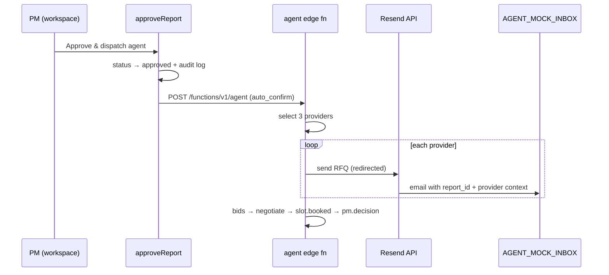

# Email Integration — RFQ on Approve

**Status:** Code wired ✅ · Resend account + secrets + live verify **TODO**
**Owner:** Track 3 (agent backend) · **Related:** [[RESOLUTION-AGENT]] · [[plans/LIVE-VERIFY-RUNBOOK]] · `fridson-app/supabase/functions/agent/lib/email.ts`

---

## What this is

When a property manager clicks **Approve & dispatch agent** on a ticket, the resolution agent:

1. Selects ~3 providers from the seeded directory (55 rows, `*@demo.test` emails)
2. Builds a tailored **RFQ (request for quote)** per provider
3. Sends (or stubs) each RFQ via **Resend**
4. Emits `rfq.sent` to the `events` table for the projection feed

For the demo we do **not** email real vendors. RFQs redirect to a **team-controlled inbox** so you can open the message and verify the payload.

---

## When email fires (flow)



**Important:** Email does **not** fire on tenant scan. Submit only triggers triage (`process-triage` webhook). RFQs fire on **Approve** only (`b0185f3`+).

---

## Three send modes

The agent picks a mode automatically based on edge-function secrets:

| Mode | When | Recipient | Demo use |
|------|------|-----------|----------|
| **stub** | No `RESEND_API_KEY` | Nobody | Offline / safe default; projection still shows `rfq.sent` with `mode: stub` |
| **mock** | `RESEND_API_KEY` + `AGENT_MOCK_INBOX` | Team inbox only | **Recommended for demo** — real email you can open, no vendor mail |
| **live** | `RESEND_API_KEY` + `AGENT_LIVE_EMAIL=1` | Provider `email` from DB (or `AGENT_LIVE_TO` allow-list) | Post-demo / production; not needed for Z2D |

Priority: **mock inbox wins** over live when `AGENT_MOCK_INBOX` is set.

---

## What the email contains

**Subject:** `Quote request — {asset_label} ({issue}) · zone {zone}`

**Body includes:**
- Asset, issue, zone
- Ask: price (EUR), earliest slot, warranty
- Budget ceiling hint
- AI disclosure footer
- `Reference: report_id={uuid}`

**Mock redirect wrapper** (prepended when using `AGENT_MOCK_INBOX`):

```
[MOCK INBOX — RFQ redirect]
Report ID: {uuid}
Intended recipient: {Provider Name} <provider@demo.test>

---
{full RFQ body}
```

---

## Tomorrow's checklist

### 1. Resend account (~10 min)

- [ ] Sign up at [resend.com](https://resend.com) (free tier is enough for demo)
- [ ] Create an API key → copy `re_...` (store in password manager, **not** in git)
- [ ] Optional: verify a custom **from** domain; otherwise default `onboarding@resend.dev` works for testing (Resend sandbox limits who can receive — see step 2)

**Resend sandbox note:** On the free/test tier, you can often only send **to the email address on your Resend account** until you verify a domain. For the demo, set `AGENT_MOCK_INBOX` to that same verified address.

### 2. Supabase secrets (~5 min)

Supabase dashboard → Project `yyidatcqbvsbntdavmww` → Edge Functions → **Secrets** (or Lovable Supabase panel):

```bash
# Minimum for demo inbox test
RESEND_API_KEY=re_xxxxxxxx
AGENT_MOCK_INBOX=you@yourinbox.com

# Optional — custom from address (must be allowed by Resend)
AGENT_FROM_EMAIL=Fridson Agent <onboarding@resend.dev>
```

Also required for the rest of the approve flow (not email-specific):

```bash
LOVABLE_API_KEY=...
FIRECRAWL_API_KEY=...
```

**Deploy:** After setting secrets, redeploy the `agent` function (Lovable sync or `supabase functions deploy agent`).

### 3. Verify agent health (~2 min)

```bash
cd fridson-app && source .env
curl -s "https://yyidatcqbvsbntdavmww.supabase.co/functions/v1/agent" \
  -H "apikey: $VITE_SUPABASE_PUBLISHABLE_KEY" \
  -H "Authorization: Bearer $VITE_SUPABASE_PUBLISHABLE_KEY"
```

Expect: `"ok": true`, `"mock_email": true` (when secrets set).

### 4. End-to-end test (~5 min)

Follow [[plans/LIVE-VERIFY-RUNBOOK]] Gate 4:

1. `/projection?feed=real` → Replay
2. Scan `/r/meeting-4f` → **Projector broken**
3. Wait for `awaiting_approval` in `/workspace`
4. **Approve & dispatch agent**
5. Check inbox for 3 RFQs (one per selected provider)
6. Confirm projection shows `rfq.sent` with `mode: mock`

**SQL sanity check:**

```sql
SELECT type, payload->>'mode' AS mode, ts
FROM events
WHERE report_id = '<report uuid>'
ORDER BY ts;
```

---

## Environment variables (reference)

| Variable | Required | Purpose |
|----------|----------|---------|
| `RESEND_API_KEY` | Yes (for any real send) | Resend API bearer token |
| `AGENT_MOCK_INBOX` | Recommended | Redirect all RFQs here; mode = `mock` |
| `AGENT_FROM_EMAIL` | No | Default: `Z2D Agent <onboarding@resend.dev>` |
| `AGENT_LIVE_EMAIL` | No | Set `1` to enable direct-to-provider sends |
| `AGENT_LIVE_TO` | No | Comma-list allow-list when live mode is on |

Secrets live on the **`agent`** edge function only. The Vite app never holds `RESEND_API_KEY`.

---

## Code map (where to look)

| File | Role |
|------|------|
| `fridson-app/supabase/functions/agent/lib/email.ts` | `buildRfq`, `sendRfq`, mode logic |
| `fridson-app/supabase/functions/agent/lib/orchestrator.ts` | Calls `sendRfq` after provider selection |
| `fridson-app/src/lib/reports.functions.ts` | `approveReport` → `invokeResolutionAgent` |
| `fridson-app/src/lib/agent-invoke.server.ts` | POST to `/functions/v1/agent` |
| `fridson-app/supabase/functions/agent/test.ts` | Offline tests incl. mock inbox redirect |

Run offline tests (requires Deno):

```bash
cd fridson-app/supabase/functions/agent && deno task test
```

---

## Not built yet (roadmap)

These are **out of scope** for tomorrow unless you want to stretch:

| Feature | Status | Notes |
|---------|--------|-------|
| **Inbound reply parsing** | Stub only | `parseInboundBids()` returns empty; bids use fixtures. Would need Resend inbound webhook or polling + parser. |
| **Real provider addresses** | Avoid for demo | Directory emails are `*@demo.test`; use mock inbox instead. |
| **Negotiation via email** | Fixture only | One negotiation round uses deterministic math, not email thread. |
| **Disapprove → re-RFQ** | API exists | `/agent/decision` disapprove re-selects providers; no UI button yet. |

---

## Troubleshooting

| Symptom | Likely cause | Fix |
|---------|--------------|-----|
| No email in inbox | Secrets not set or `agent` not redeployed | Set `RESEND_API_KEY` + `AGENT_MOCK_INBOX`; redeploy |
| Resend 403 / validation error | Sandbox can only send to verified address | Set `AGENT_MOCK_INBOX` to your Resend account email |
| `mode: stub` in events | Missing `RESEND_API_KEY` | Add secret + redeploy |
| Email on scan, not approve | Old frontend deployed | Confirm Lovable has `b0185f3`+ |
| Feed shows RFQ but no mail | Stub mode (expected without secrets) | Configure Resend per above |

---

## Success criteria

- [ ] Approve on hero ticket (`meeting-4f`) sends ≥1 email to team inbox within ~30s
- [ ] Email body includes correct `report_id`, asset, issue, and intended provider name
- [ ] Projection `/projection?feed=real` shows `rfq.sent` with `mode: mock`
- [ ] No email sent to real vendor addresses during demo rehearsal

---

## Links

- [[ACTIVE_PLAN]] Phase 3 verification checklist
- [[plans/DEPLOY-BLOCKER-REPORT]] — Supabase deploy if CLI blocked
- [[team-plans/INTERFACES]] §4 — `rfq.sent` event contract
- Resend docs: [resend.com/docs/send-with-api](https://resend.com/docs/send-with-api)
