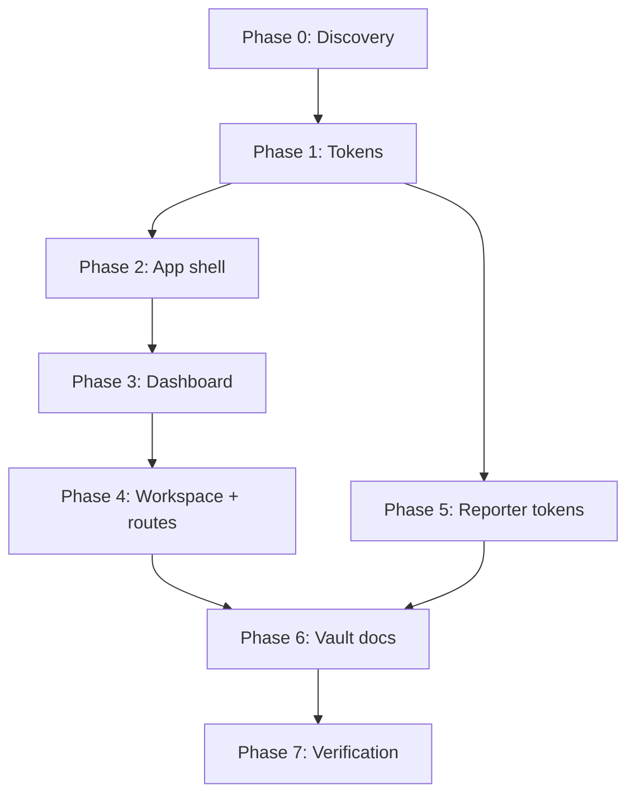

# UI Revamp — Dribbble Support Dashboard Reference

**Goal:** Revamp `fridson-app` operator UI to match the visual language of [Support Ticket System UI/UX (Dribbble)](https://dribbble.com/shots/23657590-Support-Ticket-System-Software-UI-UX) — light B2B shell, KPI cards, chart grid, activity feed — while keeping Fridson's operational identity (Linear + Carbon restraint, not a generic helpdesk clone).

**Reference screenshot:** `.cursor/projects/Users-clyde-fridson/assets/original-43cec26ae04561688e8d49b4a84d877e-110564d7-3c40-472f-87fe-aa462256a02e.png`

**App repo:** `fridson-app/` (separate git — all code changes go here)

**Design authority:** `04-Resources/fridson/design-system.md` (B2B/HMI rules override Dribbble playfulness)

---

## Design decisions (locked before Phase 1)

| Decision | Recommendation | Rationale |
|----------|----------------|-----------|
| **Accent color** | Keep Fridson cobalt `#2D5BFF` as `--primary` / `--ring` / `--status-work` | Vault design system + existing brand; Dribbble green is reference *layout*, not a rebrand |
| **Accent consistency** | All interactive chrome, charts, active nav, focus rings → `--primary`; hovers → `--primary/90` or `--secondary`; never raw `bg-blue-100` etc. | Fixes current token drift |
| **Border radius** | `--radius: 6px`; scale: `sm 4px`, `md 6px`, `lg 8px`, `xl 10px` | User request: smaller, professional B2B (Carbon-like) |
| **Card elevation** | Use `--shadow-card` on `Card` instead of generic `shadow` | Matches Dribbble soft white cards on gray bg |
| **Typography** | Load Manrope + Sora (already declared); page titles use `font-display` | Fonts declared but not loaded today |
| **Reporter routes** | Minimal token pass only (`/r/*`, `/report/*`) | GOV.UK clarity > dashboard chrome |

---

## Phase 0 — Documentation Discovery ✅

> **Agent pickup:** Read this section + verify files still match. Do not implement.

### Sources consulted

| Source | What to read |
|--------|--------------|
| `fridson-app/src/styles.css` | All theme tokens (`:root`, `@theme inline`) |
| `fridson-app/components.json` | shadcn new-york, CSS entry |
| `fridson-app/src/routes/__root.tsx` | App shell (sidebar + header) |
| `fridson-app/src/components/app-sidebar.tsx` | Nav items |
| `fridson-app/src/components/ui/{card,badge,button,sidebar,chart,breadcrumb}.tsx` | shadcn primitives |
| `fridson-app/src/lib/tokens/{urgency,status}.ts` | Domain chip helpers |
| `fridson-app/src/routes/dashboard.tsx` | Current dashboard (revamp pilot) |
| `fridson-app/src/components/dashboard/Charts.tsx` | recharts + ChartContainer |
| `fridson-app/src/routes/workspace.tsx` | 3-pane operator workspace |
| `04-Resources/fridson/design-system.md` | B2B constraints |

### Allowed APIs / patterns

**Theming (Tailwind v4 — CSS-first, no `tailwind.config.*`):**

```css
/* fridson-app/src/styles.css */
:root {
  --radius: 6px;
  --primary: #2d5bff;
  --ring: #2d5bff;
  /* + sidebar vars (see Phase 1) */
}
@theme inline {
  --radius-sm: 4px;
  --radius-md: 6px;
  --radius-lg: 8px;
  --color-primary: var(--primary);
  /* ... */
}
```

**shadcn semantic classes (use these, don't invent):**

- Surfaces: `bg-background`, `bg-card`, `bg-muted`, `bg-secondary`
- Text: `text-foreground`, `text-muted-foreground`
- Actions: `Button variant="default|outline|ghost|secondary"`
- Status: `Badge variant="outline"` + `urgencyBadgeClass()` / refactored `statusMeta()`
- Layout: `Sidebar`, `SidebarMenuButton`, `Breadcrumb`, `Card`, `Separator`
- Charts: `ChartContainer` + recharts; colors via `ChartConfig` referencing CSS vars

**Layout shell pattern (target — copy structure from Dribbble ref):**

```
SidebarProvider
├── AppSidebar (logo, nav groups, footer CTA)
└── Content column
    ├── AppHeader (breadcrumbs, page title, primary action)
    └── main (p-6, max-w-7xl, card grid)
```

### Anti-patterns (do NOT)

| Anti-pattern | Why |
|--------------|-----|
| Hardcode `bg-blue-100`, `bg-emerald-100`, `#10b981` in components | Breaks accent consistency |
| Use `hsl(var(--primary))` when `--primary` is hex | Charts render wrong (current bug in `Charts.tsx`) |
| Edit shadcn component internals for global radius/color | Change `styles.css` instead |
| Set `--radius` without updating `@theme` `--radius-md/lg` scale | Components use scale, not `--radius` alone |
| Duplicate nav in workspace header AND sidebar | Single source in sidebar; header = breadcrumbs + actions |
| Consumer-SaaS styling (large radii, rainbow cards, heavy gradients) | Violates design-system.md |
| Replace workspace triage density with spacious dashboard cards | Dashboard = overview; workspace = dense ops |

### Known gaps (verified 2026-06-28)

1. `--sidebar*` CSS vars missing from `styles.css`
2. `--chart-*` vars missing (shadcn chart theming)
3. Manrope/Sora not loaded in `__root.tsx` head
4. `status.ts` + `dashboard.tsx` use raw Tailwind palette classes
5. `Charts.tsx` uses `hsl(var(--primary))` + hardcoded `PIE_COLORS`
6. Workspace duplicates nav links in its own header
7. Root header is toggle-only (no breadcrumbs/title/CTA)

---

## Phase 1 — Foundation: Tokens, Fonts, shadcn Primitives

**Goal:** One source of truth for color, radius, shadows, sidebar, and chart tokens. All later phases inherit this.

**Prerequisites:** Phase 0 read.

### What to implement

1. **Update `src/styles.css` `:root` + `@theme inline`:**
   - Border radius scale (see Design decisions)
   - Add sidebar tokens (copy shadcn sidebar block — map to `--card` / `--secondary` / `--primary`)
   - Add chart tokens:
     ```css
     --chart-1: var(--primary);
     --chart-2: #6366f1;  /* AI only */
     --chart-3: var(--urgency-2);
     --chart-4: var(--urgency-3);
     --chart-5: var(--muted-foreground);
     ```
   - Wire `--shadow-card` on cards: update `card.tsx` class to `shadow-[var(--shadow-card)]` or add utility
   - Align `--status-work` with `--primary` (already `#2d5bff`)

2. **Load fonts in `src/routes/__root.tsx` `head`:**
   ```tsx
   links: [{ rel: "stylesheet", href: "https://fonts.googleapis.com/css2?family=Manrope:wght@400;500;600;700&family=Sora:wght@500;600;700&display=swap" }, ...]
   ```

3. **Fix chart color API in `src/components/ui/chart.tsx` usage:**
   - ChartConfig colors: use `var(--primary)` or `var(--chart-1)` (hex-safe), NOT `hsl(var(--primary))`
   - Copy pattern from [shadcn chart docs](https://ui.shadcn.com/docs/components/chart) — `color: "var(--chart-1)"`

4. **Refactor token helpers:**
   - `src/lib/tokens/status.ts` — replace `bg-blue-100` etc. with CSS var-based classes (mirror `urgency.ts`)
   - Remove duplicate `STATUS_META` from `dashboard.tsx`; import from `status.ts`

### Documentation references

- `fridson-app/src/styles.css:10-137` — current tokens
- `fridson-app/src/lib/tokens/urgency.ts:28-48` — copy-ready badge pattern
- shadcn theming: https://ui.shadcn.com/docs/theming
- shadcn sidebar theming: https://ui.shadcn.com/docs/components/sidebar#theming

### Verification checklist

- [ ] `grep -r "bg-blue-100\|bg-emerald-100\|bg-amber-100" src/` → zero hits (except migration/tests)
- [ ] `grep -r "hsl(var(--primary))" src/` → zero hits
- [ ] Sidebar renders with defined `--sidebar` bg (not transparent fallback)
- [ ] `bun run build` passes
- [ ] Visual: buttons/cards feel tighter (6px radius), cobalt primary on all CTAs

### Anti-pattern guards

- Do not add `tailwind.config.js`
- Do not change `--primary` to Dribbble green without explicit product decision

---

## Phase 2 — App Shell: Sidebar, Header, Page Layout

**Goal:** Match Dribbble shell — persistent sidebar with branding, unified header with breadcrumbs + actions, consistent page padding.

**Prerequisites:** Phase 1 complete.

### What to implement

1. **Create `src/components/app-shell/AppHeader.tsx`:**
   - Copy shadcn `Breadcrumb` pattern from https://ui.shadcn.com/docs/components/breadcrumb
   - Props: `segments: { label, href? }[]`, `title?`, `actions?: ReactNode`
   - Right side: primary CTA slot (e.g. `Button` "Add report" / "New issue")
   - Height ~56px, `border-b`, `bg-background`, `px-6`

2. **Enhance `src/components/app-sidebar.tsx`:**
   - **Header:** Logo mark + "Fridson" + optional property name subtitle (Dribbble: company + user)
   - **Nav groups:** "Operations" (Dashboard, Workspace), "Assets & Map" (QR, Graph, Schematic), "Monitor" (Activity/Projection)
   - **Active state:** Left accent bar + `bg-sidebar-accent` (Dribbble pattern — use `--primary` 2px left border)
   - **Footer:** `SidebarFooter` with muted "Need help?" link or docs (optional)
   - Add notification badge pattern on Activity item if count > 0 (use `Badge variant="secondary"`)

3. **Update `src/routes/__root.tsx`:**
   - Replace minimal header with `<AppHeader />` via outlet context OR per-route headers
   - Recommended: each route renders its own `AppHeader` inside `main` for flexible breadcrumbs
   - Root header: keep `SidebarTrigger` only OR merge trigger into AppHeader left cluster
   - Main default: `className="flex-1 bg-background p-6"` (Dribbble: light gray page, white cards)

4. **Create `src/components/app-shell/PageContainer.tsx`:**
   - `max-w-7xl mx-auto w-full` wrapper (dashboard reference is wider than current `max-w-4xl`)

5. **Remove duplicate nav from `workspace.tsx`:**
   - Delete inline header nav links (Dashboard, Graph, etc.) — sidebar is canonical
   - Keep workspace-specific controls (filters, mission strip) below AppHeader

### Copy-ready snippet locations

- Sidebar primitives: `src/components/ui/sidebar.tsx`
- Current sidebar: `src/components/app-sidebar.tsx:23-68`
- Root shell: `src/routes/__root.tsx:136-164`
- Workspace duplicate nav: `src/routes/workspace.tsx` (header section — remove)

### Verification checklist

- [ ] Every operator route shows breadcrumbs reflecting current path
- [ ] Sidebar active item has visible accent (left bar or bg)
- [ ] Workspace has no duplicate sidebar nav links
- [ ] Collapsed sidebar (icon mode) still works
- [ ] Bare routes (`/r/*`, `/report/*`) unchanged — no sidebar

---

## Phase 3 — Dashboard Revamp (Reference Page)

**Goal:** Rebuild `/dashboard` as the Dribbble reference — KPI row, chart grid, recent activity list. This becomes the template for other overview pages.

**Prerequisites:** Phases 1–2.

### What to implement

1. **KPI stat cards (top row — 4–5 cards):**
   - Copy layout from Dribbble: icon in muted circle, label uppercase small, large number
   - Use shadcn `Card` + lucide icon per KPI
   - Map to existing `DashboardStats`: Total reports, Open, Resolved, Today, Failed
   - Icon color: `text-primary` (accent consistency)

2. **Chart grid (middle row):**
   - **Wide line chart** (`md:col-span-2`): Reports over time — add gradient fill under line (`Area` or `linearGradient` in recharts), primary stroke
   - **Semi-donut / pie:** Status distribution — use `ChartContainer` + `PieChart` with `--chart-*` vars, center label "Total active"
   - **Bar chart:** Reports by type or avg created/solved — stacked or grouped bars using primary + `primary/30`

3. **Recent activity list (bottom):**
   - Replace plain list with Dribbble-style rows:
     - Left: 3px status color strip (`border-l-4` using status token)
     - Title, snippet, timestamp
     - Right: `Badge variant="outline"` + status chip from `statusMeta()`
     - Hover: `bg-muted/50` + "View" ghost button → link to `/workspace?selected={id}`
   - Use shadcn `ScrollArea` if list is long

4. **Page header:**
   - `AppHeader` segments: Support → Dashboard (or Operations → Dashboard)
   - Primary action: "View workspace" → `/workspace`

5. **Remove `max-w-4xl` constraint** — use `PageContainer` (`max-w-7xl`)

### Documentation references

- Current dashboard: `src/routes/dashboard.tsx:70-156`
- Charts: `src/components/dashboard/Charts.tsx`
- shadcn Card: `src/components/ui/card.tsx`
- recharts via shadcn Chart: https://ui.shadcn.com/docs/components/chart

### Verification checklist

- [ ] Dashboard visually matches reference: gray bg, white cards, cobalt accents in charts/icons
- [ ] All status badges use token helpers (no inline amber/blue classes)
- [ ] Charts render correct colors (no black/broken strokes)
- [ ] Click recent item → workspace with report selected
- [ ] Responsive: 2-col KPI on mobile, charts stack

---

## Phase 4 — Workspace & Operator Pages

**Goal:** Apply shell + tokens to the primary triage workspace without sacrificing density.

**Prerequisites:** Phases 1–3 (dashboard is style reference).

### What to implement

1. **`/workspace`:**
   - Add `AppHeader` ("Operations → Issue workspace")
   - `MissionControlStrip` KPI chips → use `Badge variant="outline"` + token colors (not primary fill)
   - Issue rows: tighten radius to `rounded-md`, status strip on left (Dribbble list pattern)
   - Panels: `Card` with `--shadow-card`, `rounded-lg` (8px max)
   - Keep 3-column grid; reduce visual noise (consistent borders, no one-off grays)

2. **`/admin/qr`, `/graph`, `/schematic`, `/projection`:**
   - Wrap each in `PageContainer` + `AppHeader` with correct breadcrumbs
   - Replace any raw color classes with tokens
   - Graph canvas: verify `node-paint.ts` reads `--primary` / `--status-*` at runtime (already partially done)

3. **Shared components to touch:**
   - `src/components/workspace/IssueListPane.tsx`
   - `src/components/workspace/MissionControlStrip.tsx`
   - `src/components/workspace/IssueRow.tsx` (if exists)
   - `src/components/dashboard/InsightPanel.tsx`

### Verification checklist

- [ ] Workspace feels cohesive with dashboard (same card shadow, radius, typography)
- [ ] Triage list remains dense (row height ≤ 56px)
- [ ] No regression in acknowledge/approve/merge flows
- [ ] Graph/floorplan canvases still render

---

## Phase 5 — Reporter Flow Token Pass

**Goal:** Mobile reporter stays GOV.UK-clear but picks up consistent primary, radius, fonts.

**Prerequisites:** Phase 1.

### What to implement

- `/r/$assetId`: ensure `Button`, `Input`, `Card` inherit new radius; primary CTA = cobalt
- `/report/$reportId/status`: status badges via `statusMeta()`
- Do NOT add sidebar or dashboard chrome to bare routes

### Verification checklist

- [ ] Reporter flow readable on 375px viewport
- [ ] Tap targets still ≥ 44px
- [ ] Primary button uses `--primary`

---

## Phase 6 — Vault Doc Sync

**Goal:** Design docs match shipped UI.

**Prerequisites:** Phases 1–5.

### What to implement (vault repo, not app)

- Update `04-Resources/fridson/design-system.md` § color tokens with final hex values + radius scale
- Update `02-Projects/fridson/ui-revamp-update-2026-06-27.md` or add new dated note
- Mark `LOVABLE-PROMPT.md` cobalt as canonical (remove "teal or blue" ambiguity)

---

## Phase 7 — Verification & QA

**Goal:** Prove accent consistency and no anti-patterns remain.

### Automated checks

```bash
cd fridson-app

# Token drift
rg "bg-(blue|emerald|amber|green|purple|orange)-[0-9]" src/ --glob '!*.test.*'
rg "hsl\(var\(--" src/
rg "#[0-9a-fA-F]{6}" src/ --glob '!styles.css' --glob '!node-paint.ts'

# Build
bun run build
bun run dev  # manual smoke
```

### Manual smoke routes

| Route | Check |
|-------|-------|
| `/dashboard` | KPI + charts + list match reference |
| `/workspace` | 3-pane, no duplicate nav, tokens on badges |
| `/graph` | Canvas colors match theme |
| `/r/{assetId}` | Mobile form, primary CTA |
| Sidebar collapse | Icon mode, tooltips |

### Visual acceptance (Dribbble alignment)

- [ ] Light gray page background, white elevated cards
- [ ] Single accent color (cobalt) on interactive elements and chart primary series
- [ ] Smaller border radius throughout (6px buttons, 8px cards)
- [ ] Breadcrumb + header action on operator pages
- [ ] Status colors semantic (urgency/status tokens), not decorative rainbow

---

## Execution order



**Parallelizable:** Phase 5 can run alongside Phase 2–3 after Phase 1.

**Suggested session splits:** One chat per phase (1, 2, 3, 4, 5+6+7).

---

## Agent pickup template

```markdown
You are executing **Phase N** of the UI revamp plan.
Read: `02-Projects/fridson/plans/08-ui-revamp-dribbble-support-dashboard.md`
Work in: `fridson-app/` only (separate git)
Do NOT: change accent to green, add tailwind.config, break bare reporter routes
Verify: phase checklist before marking done
```
