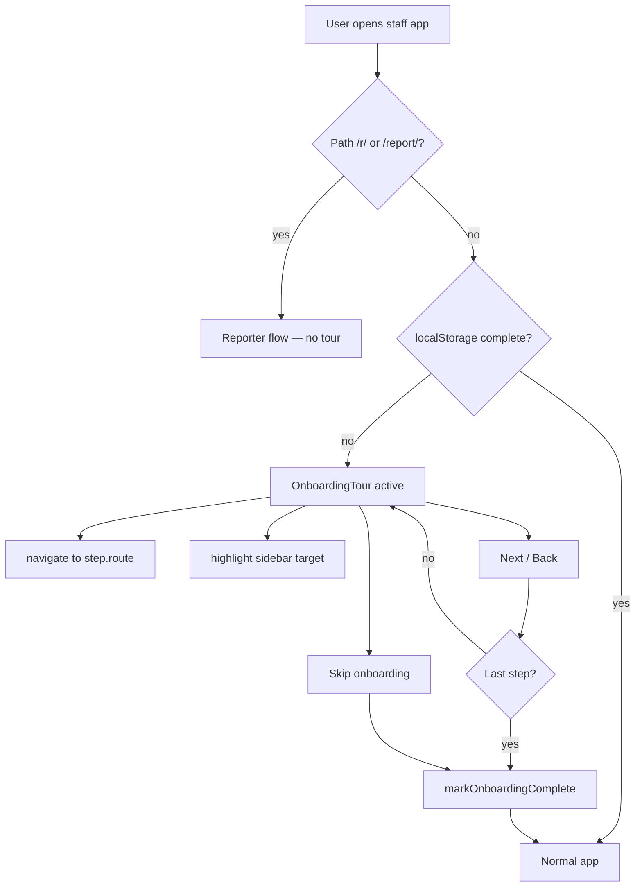

# Phase 9 — Operator Onboarding Tour (First-Launch Walkthrough)

**Status:** ✅ Shipped in `fridson-app` `c326429` (on `origin/main` at `be24035`). Verify script: `scripts/verify-onboarding.mjs`.

**Goal:** On first open of the staff app (sidebar shell), guide the operator through every main function — Dashboard, Issue workspace, QR stickers, System map, Floorplan, Activity — with **Back**, **Next**, and **Skip onboarding** controls. Never show again once completed or skipped.

**Prerequisites:** Phase 0 read. App builds cleanly (`bun run build`). No auth gate today — onboarding is per-browser via `localStorage`.

**Scope:** Staff/operator routes only (`/dashboard`, `/workspace`, etc.). **Exclude** bare reporter flows (`/r/*`, `/report/*`).

**Parallel with:** Non-blocking vs Z2D demo critical path; safe to ship post-demo.

---

## Agent pickup instructions

> You are executing one phase below. Read **Phase 0** first. Copy patterns from cited files — do **not** invent tour APIs or add undocumented library methods. Work in `fridson-app/` only (separate git repo). Each phase is self-contained for a fresh chat context.

---

## Phase 0: Documentation Discovery

### Sources consulted

| Source | What was verified |
|--------|-------------------|
| `fridson-app/src/routeTree.gen.ts:74-85` | All routes |
| `fridson-app/src/routes/__root.tsx:140-165` | Bare vs sidebar shell — hook point for onboarding |
| `fridson-app/src/components/app-sidebar.tsx:25-45` | `navGroups` — canonical feature list |
| `fridson-app/src/routes/r.$assetId.tsx:197-203,439-463` | `FlowHeader`, `StepNav` — step UX to copy |
| `fridson-app/src/components/ui/dialog.tsx` | shadcn Dialog (installed, unused in features) |
| `fridson-app/src/components/ui/carousel.tsx` | Embla carousel (installed, unused) |
| `fridson-app/src/components/ui/sidebar.tsx:21-22,85-86` | Cookie persistence pattern (reference only) |
| `fridson-app/package.json` | **No** tour libs (driver.js, react-joyride, etc.) |
| Full `src/` grep | Zero existing onboarding/tour/firstLaunch logic |

### Allowed APIs & patterns (copy from these)

| Capability | Source | Notes |
|------------|--------|-------|
| Step header ("Step N of M") | `r.$assetId.tsx:197-203` `FlowHeader` | Typography + tracking |
| Back / Continue button stack | `r.$assetId.tsx:439-463` `StepNav` | Ghost back + primary continue |
| Modal overlay | `components/ui/dialog.tsx` | `Dialog`, `DialogContent`, `DialogHeader` |
| Primary / ghost buttons | `components/ui/button.tsx` | `variant="ghost"` for Back & Skip |
| Programmatic navigation | `@tanstack/react-router` | `useNavigate()` — used throughout routes |
| Sidebar nav structure | `app-sidebar.tsx:25-45` | Single source of truth for tour steps |
| Layout gate | `__root.tsx:144` | `isBare` — do not mount tour on reporter pages |

### Anti-patterns to avoid

- ❌ Do **not** assume `react-joyride`, `driver.js`, or `@reactour/tour` exist — they are not in `package.json`
- ❌ Do **not** add Supabase `profiles` / user-preference columns — no auth UI or user table today
- ❌ Do **not** show onboarding on `/r/*` or `/report/*` (tenant-facing bare layout)
- ❌ Do **not** block app interaction with a full-screen uncloseable overlay — Skip must always work
- ❌ Do **not** use `sessionStorage` alone — survives tab close but not "first visit" across sessions inconsistently; use **`localStorage`** for completion flag

### Known gaps

- README route table is stale (`/` listed as home feed; actual redirect is `/dashboard`)
- Auth middleware exists but is unused — onboarding is browser-local, not account-linked
- No `useLocalStorage` hook — add a tiny helper or inline `localStorage` with SSR guard (`typeof window !== "undefined"`)

---

## Phase 1: Onboarding state & step config

### What to implement

**1. Step definition module** — `src/lib/onboarding/steps.ts`

Copy nav item titles/URLs from `app-sidebar.tsx:25-45`. Define a typed array:

```ts
export type OnboardingStep = {
  id: string;           // e.g. "welcome" | "dashboard" | "workspace" | ...
  route?: string;       // undefined for welcome; else path to navigate to
  title: string;
  body: string;         // 1–3 sentences, operator-focused
  sidebarTarget?: string; // data-onboarding-target value for highlight
};

export const ONBOARDING_STEPS: OnboardingStep[] = [
  { id: "welcome", title: "Welcome to Fridson", body: "..." },
  { id: "dashboard", route: "/dashboard", sidebarTarget: "nav-dashboard", ... },
  // ... one step per sidebar destination + welcome + finish
];
```

**Suggested steps (8 total):**

| # | id | route | Highlights |
|---|-----|-------|------------|
| 1 | welcome | — | Product intro, what Fridson does for PMs |
| 2 | dashboard | `/dashboard` | KPIs, charts, recent reports |
| 3 | workspace | `/workspace` | Triage queue, AI decision panel, approve flow |
| 4 | qr | `/admin/qr` | Printable asset QR stickers |
| 5 | graph | `/graph` | System map, severity filters |
| 6 | schematic | `/schematic` | Multi-floor floorplan + report pins |
| 7 | projection | `/projection` | Live activity monitor / demo feed |
| 8 | finish | `/dashboard` | "You're ready" + link to sidebar help footer |

**2. Persistence helper** — `src/lib/onboarding/storage.ts`

```ts
const KEY = "fridson:onboarding:v1";

export function isOnboardingComplete(): boolean { /* read localStorage */ }
export function markOnboardingComplete(skipped?: boolean): void { /* write */ }
export function resetOnboarding(): void { /* dev-only or settings */ }
```

Copy SSR-safe read pattern from any existing client-only code; guard with `typeof window !== "undefined"`.

**3. React hook** — `src/hooks/use-onboarding.ts`

- `stepIndex`, `goNext`, `goBack`, `skip`, `isActive`, `currentStep`
- On mount: if `!isOnboardingComplete()` → `isActive = true`
- `skip()` and final-step Next → `markOnboardingComplete(true|false)` + `isActive = false`

### Documentation references

- `app-sidebar.tsx:25-45` — step URLs and labels
- `sidebar.tsx:85-86` — cookie write pattern (reference for client persistence timing)

### Verification checklist

```bash
cd /Users/clyde/fridson/fridson-app
bun run build
```

- [ ] `ONBOARDING_STEPS` has 8 entries; every `route` (except welcome) matches `navGroups` URLs
- [ ] `isOnboardingComplete()` returns `false` on fresh browser profile
- [ ] `markOnboardingComplete()` prevents re-show on reload
- [ ] Grep: no tour library imports added yet

### Anti-pattern guards

- ❌ Do not hardcode routes not in `navGroups` (no `/assets`, no stale README paths)
- ❌ Do not store PII in localStorage value — boolean / version string only

---

## Phase 2: Onboarding UI shell (Back · Next · Skip)

### What to implement

**1. Component** — `src/components/onboarding/OnboardingTour.tsx`

Copy layout from reporter flow, adapted to a **fixed bottom card** or **Dialog** over the staff shell:

| Control | Pattern source | Behavior |
|---------|----------------|----------|
| Step label | `FlowHeader` @ `r.$assetId.tsx:197-203` | "Step {n} of {total}" |
| Title + body | `StepPanel` @ `r.$assetId.tsx:226-245` | `font-display` title, muted body |
| **Next** | `StepNav` Continue @ `439-457` | Primary, full-width on mobile |
| **Back** | `StepNav` Back @ `458-461` | Ghost, disabled/hidden on step 0 |
| **Skip onboarding** | New — ghost or link | Top-right or below Back; calls `skip()` |

Use shadcn `Dialog` with `modal={false}` **or** a `fixed bottom-4 inset-x-4 md:inset-x-auto md:right-6 md:w-96` card so the page remains visible behind the tour (typical product tour UX).

**2. Progress indicator** — optional thin bar

Copy dot/step rail visual language from `ActivityFeed.tsx` `StepRail` (horizontal done/active/pending) — cosmetic only.

**3. Button rules**

- Step 0 (welcome): hide Back; show Next + Skip
- Middle steps: Back + Next + Skip
- Last step (finish): Back + **Get started** (same as Next) + no Skip (or Skip hidden)

### Documentation references

- `r.$assetId.tsx:197-203,439-463` — copy typography and button stack
- `components/ui/dialog.tsx:9-54` — Dialog primitives if using modal variant
- `components/ui/button.tsx` — variants

### Verification checklist

- [ ] Storybook not required — manual: render `<OnboardingTour />` in isolation with mock hook
- [ ] Back decrements index; Next increments; Skip closes and persists
- [ ] Last step Next shows completion state
- [ ] Mobile: controls are tappable (min-h-11/min-h-12 per reporter flow)
- [ ] `bun run build` passes

### Anti-pattern guards

- ❌ Do not use `AlertDialog` for Skip confirm on first version — one tap skip (user request)
- ❌ Do not import Carousel unless slides are needed — route tour uses single card, not slides

---

## Phase 3: Route navigation & sidebar highlight

### What to implement

**1. Wire navigation on step change** — inside `OnboardingTour` or hook

When `stepIndex` changes and `currentStep.route` is set:

```ts
const navigate = useNavigate();
useEffect(() => {
  const route = currentStep.route;
  if (route) navigate({ to: route });
}, [stepIndex, currentStep.route]);
```

Copy `useNavigate` usage from any route file (e.g. `workspace.tsx` search param updates).

**2. Sidebar highlight targets** — `app-sidebar.tsx`

Add `data-onboarding-target={...}` to each `SidebarMenuButton` wrapper:

| nav item | target id |
|----------|-----------|
| Dashboard | `nav-dashboard` |
| Issue workspace | `nav-workspace` |
| QR stickers | `nav-qr` |
| System map | `nav-graph` |
| Floorplan | `nav-schematic` |
| Activity | `nav-projection` |

**3. Highlight CSS** — `src/components/onboarding/onboarding-highlight.css` or Tailwind in component

When tour active and `currentStep.sidebarTarget` matches:

```css
[data-onboarding-target="nav-dashboard"].onboarding-active {
  @apply ring-2 ring-primary ring-offset-2 ring-offset-background rounded-md;
}
```

Apply class via effect: query `[data-onboarding-target="${target}"]`, toggle `onboarding-active`, cleanup on unmount/step change.

**4. Optional:** expand collapsed sidebar during tour (`useSidebar().setOpen(true)`) so icons-only mode doesn't hide labels.

### Documentation references

- `app-sidebar.tsx:73-80` — menu button render loop (where to add data attributes)
- `sidebar.tsx:40-47` — `useSidebar()` API
- `__root.tsx:151-159` — tour mounts inside `SidebarProvider` so `useSidebar` works

### Verification checklist

- [ ] Step 2 → URL is `/dashboard`; step 3 → `/workspace`; … step 7 → `/projection`
- [ ] Active sidebar item shows ring highlight matching current step
- [ ] Back navigates to previous route + previous highlight
- [ ] Collapsed sidebar: tour still highlights correct icon button
- [ ] Direct visit to `/workspace` on first launch: tour still starts (mount from root, redirect welcome step if needed)

### Anti-pattern guards

- ❌ Do not use `window.location.href` — use TanStack Router `navigate`
- ❌ Do not highlight elements that don't exist on bare routes

---

## Phase 4: Root integration & dev reset

### What to implement

**1. Mount in staff shell** — `src/routes/__root.tsx`

Inside the non-bare branch, after `SidebarProvider` opens:

```tsx
<SidebarProvider>
  <div className="flex min-h-screen w-full">
    <AppSidebar />
    <main>...</main>
    <OnboardingTour />   {/* sibling, fixed position */}
  </div>
</SidebarProvider>
```

Only render when `!isBare`.

**2. First-launch detection**

On `RootComponent` mount (client): read `isOnboardingComplete()`. If false, tour hook sets active.

**3. Dev reset affordance** (optional, low priority)

- Query param `?reset-onboarding=1` clears flag (dev/demo only), or
- Hidden in sidebar footer near "Contact support" — `markOnboardingComplete` inverse

Document in code comment; remove or gate behind `import.meta.env.DEV` if preferred.

**4. Re-open from help** (optional stretch)

Sidebar footer "Need help?" could add "Replay tour" link calling `resetOnboarding()` + reload — not required for MVP.

### Documentation references

- `__root.tsx:140-165` — exact insertion point
- `app-sidebar.tsx:100+` — footer help link area

### Verification checklist

- [ ] Fresh incognito: open `/` → redirects `/dashboard` → tour visible within 1s
- [ ] Complete tour → reload → tour absent
- [ ] Skip on step 1 → reload → tour absent
- [ ] Open `/r/test-asset` → no tour overlay
- [ ] `bun run build` + `bun run dev` smoke test

### Anti-pattern guards

- ❌ Do not mount tour outside `QueryClientProvider` (needs client hydration)
- ❌ Do not run `localStorage` writes during SSR — client effect only

---

## Phase 5: Verification (final)

### Build & lint

```bash
cd /Users/clyde/fridson/fridson-app
bun run build
bun run lint   # if configured
```

### Functional checklist

| Scenario | Expected |
|----------|----------|
| First visit `/dashboard` | Welcome step visible; Skip + Next |
| Click Next through all steps | Visits all 6 feature routes; copy matches feature |
| Click Back | Returns to previous step + route + highlight |
| Click Skip onboarding (any step) | Tour closes; flag set; no re-show on reload |
| Complete last step | Tour closes; flag set |
| Second visit | No tour |
| Mobile viewport | Card readable; buttons full-width |
| `/r/:id` reporter flow | No tour |

### Anti-pattern grep

```bash
cd /Users/clyde/fridson/fridson-app
rg -i "joyride|driver\.js|shepherd|reactour" src/   # expect no matches
rg "fridson:onboarding" src/                          # expect storage key usage
rg "data-onboarding-target" src/                      # expect 6 sidebar targets
```

### Copy quality

- [ ] Each step body mentions the **action** the operator takes there (not just feature name)
- [ ] Welcome mentions tenant QR → report → PM approve loop (aligns with product definition in ACTIVE_PLAN)
- [ ] No invented API claims (e.g. don't promise login if none exists)

---

## File manifest (expected new/edited files)

| File | Action |
|------|--------|
| `src/lib/onboarding/steps.ts` | **New** — step config |
| `src/lib/onboarding/storage.ts` | **New** — localStorage |
| `src/hooks/use-onboarding.ts` | **New** — state machine |
| `src/components/onboarding/OnboardingTour.tsx` | **New** — UI |
| `src/routes/__root.tsx` | **Edit** — mount tour |
| `src/components/app-sidebar.tsx` | **Edit** — `data-onboarding-target` attrs |

---

## Architecture diagram



---

## Future extensions (out of scope for this plan)

- Account-linked preferences when auth UI lands (`requireSupabaseAuth` + `profiles.onboarding_done`)
- Spotlight/coachmark on in-page elements (workspace panes, graph filters) — would need per-route `targetSelector` in step config or a library
- Reporter-side onboarding for tenants on `/r/:id` — separate plan
- i18n for step copy

---

## Est. effort

| Phase | Time |
|-------|------|
| 0 | Done (this doc) |
| 1 | 45 min |
| 2 | 1–1.5 hr |
| 3 | 1–1.5 hr |
| 4 | 30 min |
| 5 | 30 min |
| **Total** | **~4–5 hr** |
