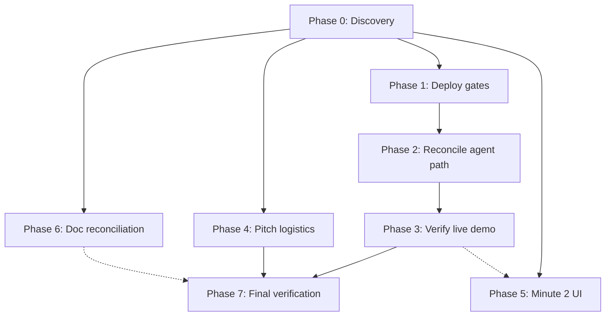

# Fridson Z2D — Execution Plans (Agent Pickup Index)

**Goal:** Win Z2D demo Sun 28 Jun 16:00 — 3-min pitch: tenant scan → schematic pinpoint → agent loop → PM approve.

**Deadline:** Sun 28 Jun · Milestone 2 **15:00** · Live demo **16:00**

**Source of truth:** [[../ACTIVE_PLAN|ACTIVE_PLAN]] · [[../06-Wiki/decisions/2026-06-27-final-commitment|Final Commitment]]

**App repo:** `fridson-app/` (`github.com/westsoever/fridson-app`, Lovable-connected, separate git)

---

## Phase plans

| Phase | File | Owner focus | Est. |
|-------|------|-------------|------|
| **0** | [[00-documentation-discovery\|00-documentation-discovery.md]] | Discovery — read first | 30 min |
| **1** | [[01-deploy-gates\|01-deploy-gates.md]] | Push, migrate, deploy, secrets | 1–2 hr |
| **2** | [[02-reconcile-agent-path\|02-reconcile-agent-path.md]] | One canonical agent trigger | 1–2 hr |
| **3** | [[03-verify-live-demo-path\|03-verify-live-demo-path.md]] | E2E demo path verification | 1–2 hr |
| **—** | [[LIVE-VERIFY-RUNBOOK\|LIVE-VERIFY-RUNBOOK.md]] | Post-deploy hero flow + approve email | 15 min |
| **4** | [[04-pitch-logistics\|04-pitch-logistics.md]] | Human logistics + fallbacks | parallel |
| **5** | [[05-minute-2-context-ui\|05-minute-2-context-ui.md]] | Stakeholder lens UI (optional) | 2–3 hr |
| **6** | [[06-doc-reconciliation\|06-doc-reconciliation.md]] | Vault docs ↔ code reality | 30 min |
| **7** | [[07-final-verification\|07-final-verification.md]] | Full dry-run + timing | 1 hr |

---

## Execution order



### Sequential (blocking)

1. **Phase 0** — every agent reads this (or the discovery section in their phase)
2. **Phase 1** — push + migrate + deploy + secrets (blocks live verification)
3. **Phase 2** — pick one agent path (blocks clean projection feed)
4. **Phase 3** — E2E verification on live stack
5. **Phase 7** — full dry-run (after 1–4 complete)

### Parallel (safe to run concurrently)

| Can run in parallel | Must NOT touch |
|---------------------|----------------|
| **Phase 4** (human logistics) | App code |
| **Phase 5** (Minute 2 UI) | `reports.functions.ts`, edge functions, migrations (Phase 1–2) |
| **Phase 6** (doc reconciliation) | `fridson-app/` code |

**Phase 5** can start after Phase 0; ideally after Phase 3 confirms the ticket/report shape.

---

## Critical path summary

```
Deploy (P1) → Agent reconcile (P2) → Live verify (P3) → Dry-run (P7)
```

Human logistics (P4) runs on the side but **blocks P7** if QR codes, brand, or hardware are unset.

---

## Verified blockers (2026-06-28)

- App git **diverged**: local +3 (schematic), origin +3 (Lovable sync) — merge before push
- **22 migrations** in repo; live Supabase may be behind — `db push` required
- **Dual agent trigger**: `submitReport` → `invokeResolutionAgent` **and** DB webhook → `process-triage`
- `/projection?feed=real` depends on `events` table + Realtime (migration + agent path)
- Schematic commits (`e4234ec`) not on Lovable until push completes

---

## Related

- [[../team-plans/INTERFACES|INTERFACES contract]]
- [[../pitch/script|3-min pitch script]]
- [[../pitch/logistics|Demo logistics]]
- `fridson-app/HANDOFF.md` — webhook agent deploy checklist
