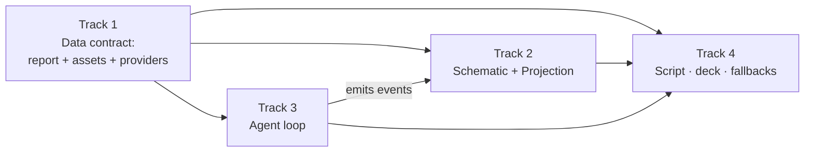

# Team Plans — 4 Parallel Tracks

The single [[ACTIVE_PLAN]] split into **4 self-contained tracks** so the whole team builds at the same time without stepping on each other's files. Each person reads **only their own track file** + [[INTERFACES]] (the shared contract).

> **Golden rule:** stay inside your *You own* boundary. If you need something from another track, use the data shape / event names in [[INTERFACES]] — don't reach into their files.

---

## Ownership matrix (who does what, where)

| Track | Owner | Phases / build items | Code & files you own | Touches |
|-------|-------|----------------------|----------------------|---------|
| **1 · Capture & Data** | Chris | P1 + Roadmap #3 | Supabase schema & seed (reports, assets, providers); Capture pages verify | DB / seed |
| **2 · Schematic & Projection** | Slavi | P2 (#2) + P4 (#8) | `/schematic`, `/projection` pages & components, marker + activity-feed UI | Frontend |
| **3 · Agent Backend** | Alex | P3 (#4–#7) | Agent service (Azure) + `/agent` API: select → RFQ → negotiate → book → approve/audit | Backend |
| **4 · Pitch & Business** | Lennert | P5, P6, P7 | Deck, `pitch/` docs, script, QR prints, fallback recordings, submission | Docs / slides |

*Assignments are a starting suggestion — swap by skill, but keep **one owner per track**.*

---

## How the tracks fit together

- **Track 1 ships the data contract first** (report shape, asset coords, 50-provider directory). Everyone else builds against it (ask Chris before any schema change).
- **Tracks 2 & 3 run fully in parallel** by agreeing on the **event feed** in [[INTERFACES]] — Track 2 builds the projection against *mock* events; Track 3 emits *real* ones. Last step is to flip mock → real.
- **Track 4 needs no code** — it works off screenshots/outputs and owns the narrative, slides, and logistics.

## No-collision rules
1. **DB schema changes go through Track 1 only.** Need a new column/table? Ask Chris; don't migrate yourself.
2. **One owner per page/component.** Track 2 owns `/schematic` & `/projection`; Track 3 owns `/agent` + the service. Capture pages belong to Track 1.
3. **Communicate via events & data, not files** — the contract in [[INTERFACES]] is the only shared surface.
4. **Branch per track** if working in git: `track1-data`, `track2-projection`, `track3-agent`, `track4-pitch`. Merge to `main` via small PRs.
5. **GATE still applies:** Track 3's heavy build waits until Track 1 (#1 report) and the directory are demo-able.

## Files
- [[INTERFACES]] — shared data + event contract (read this second)
- [[track-1-capture-data]] · [[track-2-schematic-projection]] · [[track-3-agent-backend]] · [[track-4-pitch-business]]
- Parent: [[ACTIVE_PLAN]] · [[ROADMAP]]
