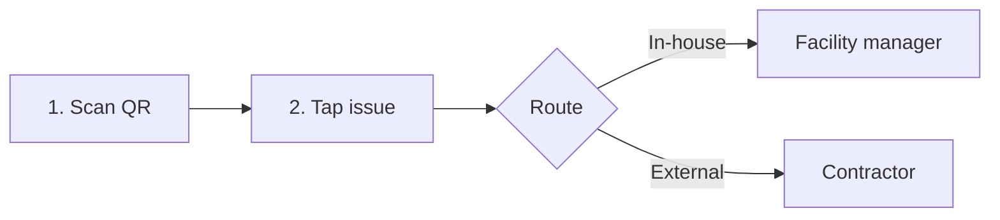

# MVP Flow — Scan, Tap, Route

**Project:** [[02-Projects/z2d-lifecycle/ACTIVE_PLAN|Z2D Lifecycle Platform]] · Team Fridson
**Status:** Draft — demo wedge candidate
**Related:** [[06-Wiki/Problem|Problem]] · [[02-Projects/z2d-lifecycle/README|Project README]]

---

## One-sentence demo

> An office worker scans a QR sticker on any asset or room, taps what's wrong, and the right person — in-house facility manager or external contractor — gets an instant message with location and context.

---

## Why this wedge

| Criterion | Fit |
|-----------|-----|
| **PRODUCT** | Three taps, no app install — judges can try it on their phone |
| **PROBLEM** | Reactive maintenance starts with *someone noticing* — this removes friction from reporting |
| **VALIDATION** | QR + ticketing exists (Facilio, Planon) but routing to the *right* responder in one tap is the hook |
| **SPEED & DEMO** | Buildable in hours: static QR pages + issue buttons + Slack webhook |

Complements (does not replace) the sensor → dashboard story: sensors predict; this flow captures human-reported issues at the point of failure.

---

## The flow



### Step 1 — Scan QR code

**Actor:** Anyone in the building (employee, visitor, cleaning staff)

**Trigger:** Camera scan of a printed QR sticker

**What happens:**
- QR encodes a URL: `https://[app]/r/{asset-id}` (or `/r/{zone-id}`)
- Mobile browser opens — no login required for reporting
- Page loads **context**: asset name, floor, zone, photo thumbnail (optional)
- QR stickers placed on: printers, bathrooms, meeting rooms, kitchen, pump room, entrance

**MVP scope:**
- 3–5 pre-seeded assets for demo (e.g. `printer-3f`, `bathroom-2f`, `pump-basement`)
- Each QR is a unique URL — location is implicit, zero typing

**Demo beat:** Judge scans sticker on table → page says *"Printer · 3rd floor · East wing"*

---

### Step 2 — Tap issue

**Actor:** Same person who scanned

**UI:** Grid of large tap targets — one tap to submit (no form fatigue)

**Issue sets by asset type:**

| Asset type | Tap options |
|------------|-------------|
| **Printer** | Out of paper · Jammed · Offline · Toner low |
| **Bathroom** | No soap · Leak · Blocked · Needs cleaning |
| **Meeting room** | Projector broken · Too cold/hot · Needs reset |
| **Pump / plumbing** | Unusual noise · Leak visible · Not running |
| **Kitchen** | Empty cups/water · Appliance broken · Spill |

**Optional (stretch):** Add photo — skip for MVP if it slows the demo

**What happens on tap:**
- Issue + asset context bundled into a payload
- Brief confirmation screen: *"Sent to facility team"* with issue summary
- No account, no ticket number required for demo

**Demo beat:** Judge taps *"Out of paper"* → instant success state

---

### Step 3 — Send message

**Actor:** System routes; human receives

**Routing rules (MVP):**

| Issue category | Recipient | Channel (MVP) |
|----------------|-----------|---------------|
| Replenishment, cleaning, minor hardware | **In-house facility manager** | Slack `#facility` |
| Plumbing, HVAC, electrical, specialized repair | **External contractor** | Slack `#contractors` or DM |

**Message format (Slack):**

```
🔧 New issue · Printer · 3rd floor East
Issue: Out of paper
Reported: 27 Jun 14:32
Asset ID: printer-3f
→ [View asset] (optional link back to dashboard)
```

**Routing logic (simple):**

```
if issue in [leak, blocked, unusual noise, not running, too cold/hot]:
  → external contractor
else:
  → in-house facility manager
```

**Demo beat:** Slack channel lights up on projector while judge still holding phone

---

## Actors

| Role | In demo | Responsibility |
|------|---------|----------------|
| **Reporter** | Judge / teammate | Scan → tap → done |
| **In-house FM** | Teammate on laptop | Receives replenishment & minor issues |
| **External contractor** | Second Slack channel or persona | Receives plumbing / infrastructure issues |
| **Admin (us)** | Behind the scenes | Pre-seeded assets, QR printouts, routing table |

---

## Minimal data model

```
Asset
  id          string   "printer-3f"
  name        string   "Printer · 3rd floor East"
  type        enum     printer | bathroom | meeting_room | pump | kitchen
  zone        string   "3F-East"
  route_default  enum  inhouse | external

Issue
  id          string
  asset_id    string
  label       string   "Out of paper"
  route       enum     inhouse | external

Report (created on tap)
  asset_id    string
  issue_id    string
  timestamp   datetime
  reporter    optional — skip for MVP
```

---

## Demo script (~90 seconds)

1. **Hook (10s):** *"Buildings fail reactively because reporting is painful. Watch."*
2. **Scan (15s):** Judge scans QR on printer sticker → context page loads
3. **Tap (10s):** Judge taps *Out of paper*
4. **Payoff (15s):** Slack `#facility` message appears on screen — location + issue, no form
5. **Contrast (20s):** Scan bathroom QR → tap *Leak* → message goes to `#contractors` instead
6. **Close (20s):** *"Right person, right time, zero friction — predictive layer comes next."*

---

## Build checklist (Sat afternoon)

- [ ] Generate 3–5 QR codes pointing to asset URLs
- [ ] Print stickers (or tape printed codes to demo props)
- [ ] Mobile web page: asset context + issue button grid
- [ ] Issue → route lookup table
- [ ] Slack incoming webhook(s) for in-house + contractor channels
- [ ] End-to-end test: scan → tap → Slack in < 3 seconds

---

## Out of scope (MVP)

- User accounts / authentication
- Ticket tracking dashboard (stretch: read-only list)
- Sensor integration (Phase 2 story)
- Photo upload
- Multi-building / multi-tenant admin
- Contractor SLA or escalation

---

## Open decisions

- [ ] **App host:** Lovable static page vs custom HTML on Azure
- [ ] **Slack:** one webhook with routing in message text, or two channels?
- [ ] **Demo props:** real office items at The Shack vs printed asset cards
- [ ] **Naming:** product name for QR landing page header

---

## Related

- [[06-Wiki/Problem|Problem — Office Lifecycle Management]]
- [[02-Projects/z2d-lifecycle/ACTIVE_PLAN|Active Plan]]
- [[04-Resources/Z2D/finding-the-problem|Finding the Problem]]
